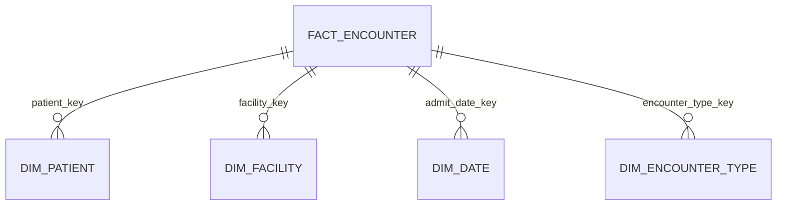
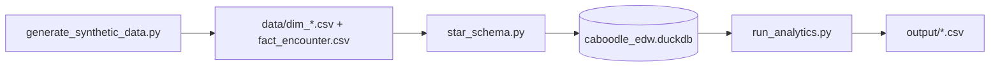

# Caboodle EDW Star Schema Lab (Synthetic Enterprise Warehouse)

**Author:** [Faiz Elahi](https://github.com/faizelahi) · **Type:** EDUCATIONAL LAB · **Not Epic Caboodle**

---

## Educational disclaimer / synthetic data

This lab implements a **Caboodle-inspired star schema** using CSV dimensions and facts loaded into **DuckDB**. It is **not** Epic Caboodle, **not** Clarity, and **not** connected to any EHR. Patient keys, facilities, and encounter counts are **synthetic**.

Readmission metrics are a **teaching proxy**, not CMS HRRP methodology. Use the lab to practice dimensional modeling and KPI SQL—never to benchmark real hospitals.

---

## Problem statement (detailed)

Enterprise healthcare data warehouses (often fed by EHR extracts) publish **conformed dimensions** (patient, facility, date, encounter type) and **fact tables** at explicit grain (one row per encounter). Executive questions—“What is inpatient **ALOS** by facility?” “What is our **readmission proxy** trend?”—depend on consistent joins through those dimensions.

Analysts entering health IT may understand SQL but not **star schema discipline**: role-playing dates, surrogate keys, and fact grains. This lab:

1. Generates **`dim_*`** and **`fact_encounter.csv`** with ~2,800 encounters.
2. Loads tables into **`data/caboodle_edw.duckdb`** via `src/star_schema.py`.
3. Runs analytics in `src/run_analytics.py` producing **`output/alos_by_facility.csv`** and readmission proxy outputs.

You learn to explain **grain**, **conformed dimensions**, and **honest KPI labeling** in one readable codebase.

---

## Why this tool

| Wide export CSV | Star schema in DuckDB |
|-----------------|------------------------|
| Repeated denormalized columns | Reusable dimensions |
| Ambiguous grain | Fact table documents one encounter per row |
| Ad hoc date parsing | `dim_date` role-playing keys |

DuckDB gives **desktop speed** without a warehouse bill—ideal for classroom star schema joins identical in spirit to SQL Server / Snowflake marts.

---

## Architecture





See [`docs/architecture.md`](docs/architecture.md).

---

## Dataset dictionary (tables / columns)

### `dim_patient.csv` (~600 rows)

| Column | Description |
|--------|-------------|
| `patient_key` | Surrogate key |
| `patient_id` | Business id `P00001` style |
| `sex` | `F` / `M` synthetic |
| `birth_year` | Integer year |

### `dim_facility.csv` (3 rows)

| Column | Description |
|--------|-------------|
| `facility_key` | Surrogate key |
| `facility_id` | `F1`, `F2`, `F3` |
| `facility_name` | Synthetic Medical Center, Community Hospital, Ambulatory Pavilion |

### `dim_date.csv` (366 rows for 2024)

| Column | Description |
|--------|-------------|
| `date_key` | 1…366 |
| `full_date` | ISO date |
| `year`, `month`, `day_of_week` | Calendar attributes |

### `dim_encounter_type.csv`

| Column | Description |
|--------|-------------|
| `encounter_type_key` | 1 Inpatient, 2 Emergency, 3 Ambulatory |
| `encounter_type` | Label |

### `fact_encounter.csv` (~2,800 rows)

| Column | Description |
|--------|-------------|
| `encounter_id` | Fact grain key |
| `patient_key` | FK → dim_patient |
| `facility_key` | FK → dim_facility |
| `encounter_type_key` | FK → dim_encounter_type |
| `admit_date_key` | FK → dim_date |
| `length_of_stay_days` | Inpatient LOS; empty for non-IP types |

---

## Prerequisites

- Python 3.10+
- `pandas`, `duckdb` (see `requirements.txt`)
- No Epic or Caboodle access

---

## Step-by-step: how to run

### Windows PowerShell

```powershell
cd caboodle-edw-star-schema-lab
python -m venv .venv
.\.venv\Scripts\Activate.ps1
pip install -r requirements.txt
python scripts/generate_synthetic_data.py
python src/run_analytics.py
python scripts/generate_charts.py
```

### Optional bash

```bash
cd caboodle-edw-star-schema-lab
python3 -m venv .venv && source .venv/bin/activate
pip install -r requirements.txt
python scripts/generate_synthetic_data.py
python src/run_analytics.py
python scripts/generate_charts.py
```

---

## File-by-file walkthrough

| Path | Role |
|------|------|
| `scripts/generate_synthetic_data.py` | Builds all dimension and fact CSVs under `data/` |
| `src/star_schema.py` | Creates DuckDB tables and KPI SQL helpers |
| `src/run_analytics.py` | Executes analytics; writes `output/alos_by_facility.csv` and `output/readmission_proxy.csv` |
| `scripts/generate_charts.py` | Visualization outputs for documentation |
| `data/caboodle_edw.duckdb` | Persisted database after load (regenerated on run) |
| `docs/architecture.md` | Extended ER narrative |

---

## Expected outputs and how to interpret them

| Output | Interpretation |
|--------|----------------|
| `output/alos_by_facility.csv` | Average length of stay for **inpatient** encounters by facility name |
| `output/readmission_proxy.csv` | Single-row summary: index inpatient count, readmit pairs, `readmit_proxy_rate`—**not CMS** |
| Charts under `docs/images/` | Visual support for README and slides |

High readmission proxy rates may appear when synthetic generator clusters inpatient dates—use as SQL practice, not quality judgment.

---

## Results interpretation

- **ALOS** excludes null LOS rows (non-inpatient types)—verify filters in SQL before presenting.
- **Readmission proxy** teaches **cohort logic**; label slides “proxy” every time.
- **Facility distribution** reflects generator weights (ED/IP/ambulatory mix)—not market share.

---

## Glossary (8+ terms)

1. **Fact table** — Events at defined grain (one row per encounter).
2. **Dimension table** — Descriptive context (who, where, when, what type).
3. **Conformed dimension** — Shared dimension reused across multiple facts.
4. **Surrogate key** — Integer `*_key` independent of business id changes.
5. **Grain** — What one fact row represents.
6. **Role-playing date** — Same date dim joined on admit (discharge optional extension).
7. **ALOS** — Average length of stay for inpatient encounters.
8. **Readmission proxy** — Teaching metric; not regulatory CMS definition.
9. **Star schema** — Facts at center, dimensions radiating outward.

---

## Common mistakes (5+)

1. Aggregating facts at **patient grain** without deduplicating encounters.
2. Calling the readmission proxy **“CMS readmission rate.”**
3. Forgetting to **cast dates** before interval math in DuckDB/SQL.
4. Joining **`dim_date`** on wrong key (business date vs `date_key`).
5. Including **ambulatory rows** in LOS averages.
6. Treating synthetic facility names as **real organizations**.

---

## Exercises (5+)

1. Add **`dim_provider`** and link from fact (new FK column + generator update).
2. Compute **monthly encounter counts** using `dim_date.year/month`.
3. Compare **ALOS by encounter type** with null-safe filters.
4. Create DuckDB **views** mirroring mart naming (`mart_encounter_daily`).
5. Document **slowly changing dimension** plan for patient demographics (SCD2 narrative only).
6. Cross-check totals with **`epic-clarity-reporting-lab`** themes (Clarity vs mart).

---

## Limitations / simulation vs production

| This lab | Production Caboodle / EDW |
|----------|---------------------------|
| CSV bulk load | ETL from Clarity / Chronicles |
| No SCD2 history | Patient demographic history tracking |
| Proxy readmissions | Certified quality measure logic |
| DuckDB local file | Enterprise warehouse + security |

No real MRNs, no HIPAA-covered data.

---

## Related labs

- [`epic-clarity-reporting-lab`](../epic-clarity-reporting-lab/) — Clarity-style reporting concepts.
- [`dbt-healthcare-marts-lab`](../dbt-healthcare-marts-lab/) — dbt-tested healthcare marts.
- [`hedis-quality-measures-lab`](../hedis-quality-measures-lab/) — Quality measure framing.
- [`hl7-fhir-interop-lab`](../hl7-fhir-interop-lab/) — Operational clinical messages vs warehouse facts.
- [`apache-superset-dashboard-as-code-lab`](../apache-superset-dashboard-as-code-lab/) — BI on mart outputs.

---

**Author:** Faiz Elahi · Educational portfolio only.
